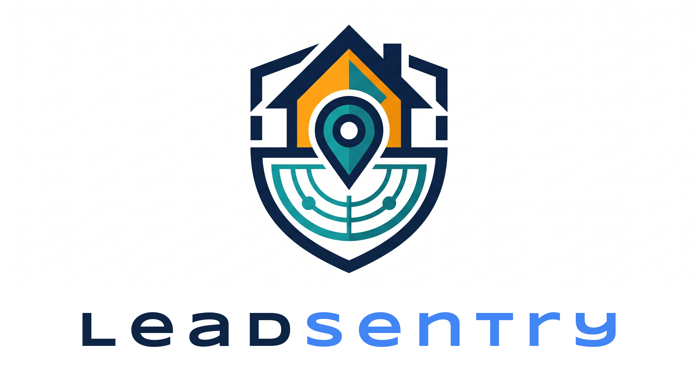
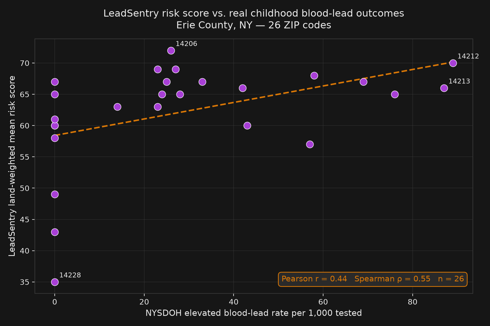

# LeadSentry

<p align="center">
  
</p>

<p align="center"><em>Know which door to knock on first.</em></p>

<p align="center">
  <a href="https://qainsights.github.io/leadsentry/">View the one-pager</a>
</p>

Childhood lead-exposure risk triage agent for the Mireye Build Challenge.

Lead poisoning in children is almost entirely preventable, but by the time it is caught the damage is done. CDC estimates roughly **500,000 U.S. children** have a blood lead level at or above the 3.5 μg/dL reference value. Health departments have the budget to test, but not the budget to decide which addresses to visit first. LeadSentry does that triage: it reasons over physical-world data per address, scores risk, and drafts the follow-up action (outreach letter or test-kit dispatch), with every number cited to its source.

## What it combines

Mireye's catalog does not include a year-built field, so LeadSentry pairs Mireye with US Census ACS Table B25034 (Year Structure Built) at the tract level, joined through Mireye's `tract_geoid` field. Pre-1980 housing share is the backbone of CDC/HUD lead-risk models.

| Score component | Weight | Source |
|---|---|---|
| Pre-1980 housing share | 0-50 | Census ACS B25034 (via free Census API key) |
| Legacy contamination (Superfund / brownfield / RCRA TSD / open LUST) | 0-30 | Mireye (EPA SEMS / ACRES / RCRA / UST Finder) |
| Water service gap (outside CWS area, high domestic-well density) | 0-20 | Mireye (EPA CWS Service Areas V3.0) |

Bands: 0-30 low, 31-60 moderate, 61-100 priority.

## Agent design

A vendor-agnostic LLM (any provider; set `LLM_MODEL=provider:model`) drives the loop: fetch Mireye facts, join Census tract data, compute the deterministic score, reason about data quality (`parcelGrade=false` caps confidence; heavy nulls downgrade it), then decide and record an action. The action writes a real artifact to `actions/`.

Every report also shows an **Agent vs. rule baseline** table. The same rule-based policy used by the offline fallback is applied to the same data, so you can see exactly where and why the agent upgraded or downgraded an action.

If no LLM key is available, the pipeline falls back to clearly-labeled, rule-based offline triage and still produces a complete report.

## Running it

```bash
npm install
cp .env.example .env
# Add MIREYE_API_TOKEN, CENSUS_API_KEY, and LLM_MODEL
npm start -- --input data/sample-addresses.json --output report.md
```

Tokenless demo against clearly-labeled illustrative fixtures:

```bash
npm run demo
```

## ZIP code mode

Per-address triage across a whole ZIP is wasteful. ZIP mode screens an entire ZIP cheaply first:

```bash
npm start -- --zip 14213
```

Stage 1 maps the ZIP to its census tracts (free Census ZCTA-tract relationship file and Gazetteer internal points, downloaded once and cached), scores each tract with one Mireye point sample and one Census call, then the agent turns the ranking into a canvassing plan: which tracts get door-to-door saturation, which get mailers, which get monitored, and where the expensive per-address stage-2 budget should go.

### Deep dive: `--deep N`

Add `--deep N` to run stage 2 automatically:

```bash
npm start -- --zip 14213 --deep 5
```

LeadSentry selects the highest-priority canvass tract(s), samples N real addresses inside them (Census TIGERweb tract polygon plus OpenStreetMap addresses, both free and no keys), and runs the per-address agent. One command produces both the ZIP canvassing plan and the ranked per-address report with outreach letters and dispatch CSV.

If the ZIP screens mostly low-risk, `--deep` skips stage 2 and records that decision in the report so you can reallocate the budget elsewhere.

### Redaction: `--redact`

For public-facing reports, add `--redact` to replace street numbers and coordinates with placeholders:

```bash
npm start -- --zip 14213 --deep 5 --redact
```

## Ground-truth validation

LeadSentry correlates its ZIP-mode scores with real childhood blood-lead outcomes from the [NYSDOH Childhood Blood Lead Testing and Elevated Incidence by Zip Code](https://health.data.ny.gov/Health/Childhood-Blood-Lead-Testing-and-Elevated-Incidenc/d54z-enu8) dataset.

Across **26 ZIP codes in Erie County, NY**, LeadSentry's land-weighted mean risk score shows a **Spearman ρ of 0.55** and a **Pearson r of 0.44** with the observed elevated-BLL rate per 1,000 children tested.



High-impact ZIPs align with the model:
- **14212**: LeadSentry 70 · NYSDOH 89 EBLLs per 1,000 tested
- **14213**: LeadSentry 66 · NYSDOH 87 EBLLs per 1,000 tested
- **14204**: LeadSentry 57 · NYSDOH 57 EBLLs per 1,000 tested

Low-risk ZIPs also align:
- **14221**: LeadSentry 43 · NYSDOH 0 EBLLs per 1,000 tested
- **14228**: LeadSentry 35 · NYSDOH 0 EBLLs per 1,000 tested

Validate a single ZIP:

```bash
npm start -- --zip 14213 --validate
```

Run the multi-ZIP study:

```bash
npm run validate:erie
```

## Model portability

`LLM_MODEL` uses `provider:model` syntax and works with any provider the Vercel AI SDK supports:

- `openai:gpt-4o` (needs `OPENAI_API_KEY`)
- `anthropic:claude-sonnet-4-5` (needs `ANTHROPIC_API_KEY`)
- `google:gemini-2.5-flash` (needs `GOOGLE_GENERATIVE_AI_API_KEY`)
- `deepseek:deepseek-chat` or `deepseek:deepseek-reasoner` (needs `DEEPSEEK_API_KEY`)
- `meta:muse-spark-1.2` (needs `MODEL_API_KEY`)
- `openai-compatible:llama3.1` with `LLM_BASE_URL` (Ollama, vLLM, LM Studio, etc.)

Mireye is reached through its hosted MCP server (`api.mireye.com/mcp`) with a bearer token. If MCP auth is refused, LeadSentry falls back to the deterministic REST `/v1/fetch` automatically; same tools, same agent loop.

## Tests

```bash
npm run typecheck
npm test
```

## Limitations and next steps

- ACS is tract-level, not parcel-level. A v2 would weight by block group.
- The contamination sub-score is a distance-threshold rule. A v2 would fit it against blood-lead surveillance data per tract.
- Water-service fields flag regulatory gaps (private wells), not confirmed lead service lines. EPA's Lead Service Line Inventory would sharpen this.

## Author

Built by [NaveenKumar Namachivayam](https://qainsights.com) for the Mireye Build Challenge.
